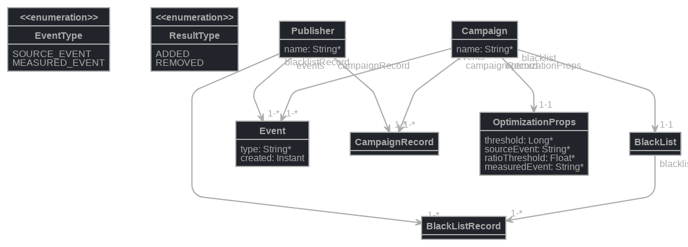

[](https://travis-ci.org/Aqueelone/optimizationJob)
[](http://commitizen.github.io/cz-cli/)

# optimizationJob

## What we have to do?
We achieve quality goals with optimize campaigns by blacklist publishers who do not qualify campaign's expectations.
So, we have two conditions which put the publisher to the campaign's blacklist:

    publisher have equile or more then _threshold_ _sourceEvents_ 
    publisher have _measureEvents_ less then _ratioThreshold_ % of _sourceEvents_
    for this task we compute time range: from `LocaldateTime.now()` to `this time minus 3600*24*12 seconds`

## Stage 1. Modeling.
I'd better use for this task EventSourcing with immutable Events, but time limit forcing me use DDD architecture task design.
So, as result of my meditation, I have next model:

This model develop with [JHipster JDL Studio](https://start.jhipster.tech/jdl-studio/)

## Stage 2. 
Using [JHipster Online](https://start.jhipster.tech) make up new applications, applying [JDL-Model](optjob.jh)
Put it on [GitHub optimizationJob repository](https://github.com/Aqueelone/optimizationJob) 

## Stage 3.
As a spike, use command
`jhipster spring-controler optimizationJob` 
and generate a skeleton for our task spring controller

Such as we are TDD's like team, develop [optimizationJob IntegrationTest](src/test/java/com/acceptic/test/opt/web/rest/OptimizationJobResourceIntTest.java)

Start `./gradlew optJobTest` (special gradle test task for our needing which we develop).. All tests are "red" and it is expected..

## Stage 4.
Start develop main task as [optimizationJobResourceRESTController](src/main/java/com/acceptic/test/opt/web/rest/OptimizationJobResource.java)

Some decisions:
[EventType Enum](src/main/java/com/acceptic/test/opt/domain/enumeration/EventType.java) --so.. we have two types of event and the good idea it is as enum

[ResultSet Enum](src/main/java/com/acceptic/test/opt/domain/enumeration/EventType.java) --so.. we have two work result types, enum could be used such as in main stage, such as in test class too... 

[CounterMap which extend EnumMap](src/main/java/com/acceptic/test/opt/web/rest/util/CounterMap.java)  -- EnumMap is better for our event holding with enum types, but we extend at because we implement quickly incrementing, it better compile (because we defined strong using Long) and `toJson` functionality which we could use in tests

[Publisher-in-Campaign Event Holder as CounterMap<EventType>](src/main/java/com/acceptic/test/opt/web/rest/OptimizationJobResource.java) -- it performance up when using `in big tree`

[resultSet as CounterMap<ResaltSet>](src/main/java/com/acceptic/test/opt/web/rest/OptimizationJobResource.java) good for result and [using in test](src/test/java/com/acceptic/test/opt/web/rest/OptimizationJobResourceIntTest.java) for catch expected result

[ModifyTreeMap which extend TreeMap](src/main/java/com/acceptic/test/opt/web/rest/util/ModifyTreeMap.java) --so.. we use TreeMap with [CampaignRecords Entity](src/main/java/com/acceptic/test/opt/domain/CampaignRecord.java) as key, where we define two-dimension comparator (the first dimension is `campaign` and second dimension is `publisher` -- this is good help for build red-black search tree, based for TreeMap), additionally we implement `quick replace` functionality, it accelerate this operations because `compiler know` about our CounterMap as the possible value of it and reserve constant certain `block of memory` for each key-value pair, therefore our `quick replace` is workable 

[Strong DRY compliance](src/main/java/com/acceptic/test/opt/web/rest/OptimizationJobResource.java) --in conjunct with `logger debug messages` it make debug process easy 

Start `./gradlew optJobTest`... All tests are `green` and passed

## Stage 5. Build our application in developer mode

Before you can build this project, you must install and configure the following dependencies on your machine:

1. [Node.js][]: We use Node to run a development web server and build the project.
   Depending on your system, you can install Node either from source or as a pre-packaged bundle.
2. [Yarn][]: We use Yarn to manage Node dependencies.
   Depending on your system, you can install Yarn either from source or as a pre-packaged bundle.

After installing Node, you should be able to run the following command to install development tools.
You will only need to run this command when dependencies change in [package.json](package.json).

    yarn install

We use yarn scripts and [Webpack][] as our build system.

Clone this project to local machine with 'git clone'

Run the following commands in terminal from _project_root_ :

    ./gradlew buildNeeded initPath yarn 
    yarn start

After this we stop it with `cntl+C` caused there is no need to change the graphic design
And start our applications with command

    ./gradlew bootRun

In localhost:8080 we could see it as the workable one.
In menu `Entities` we could choose some entity type and add it
In menu `Administration\API` we could choose our `optimizationJobResource` and try use it 

## Some possible TODOs

1. It possible would be implemented with EventSourcing Architecture Design with immutable event
2. It possible would be integrated with Apache Kafka (it is `in box` possible on JHipster) ane we'll could do producer\consumer message processing
3. It possible would be done with using microservice architecture as `blacklist microservice`, `event receiving microservice` and `campaign holding microservice`
4. It possible would be done with JHipster 5 (It use Spring 5, Spring Boot 2 and ReactJS), but now it in `beta stage` 

## Using framework...

This application was generated using JHipster 4.14.2, you can find documentation and help at [http://www.jhipster.tech/documentation-archive/v4.14.2](http://www.jhipster.tech/documentation-archive/v4.14.2).

## Additional development with JHipster

[Yarn][] is also used to manage CSS and JavaScript dependencies used in this application. You can upgrade dependencies by
specifying a newer version in [package.json](package.json). You can also run `yarn update` and `yarn install` to manage dependencies.
Add the `help` flag on any command to see how you can use it. For example, `yarn help update`.

The `yarn run` command will list all of the scripts available to run for this project.

### Service workers

Service workers are commented by default, to enable them please uncomment the following code.

* The service worker registering script in index.html

```html
<script>
    if ('serviceWorker' in navigator) {
        navigator.serviceWorker
        .register('./sw.js')
        .then(function() { console.log('Service Worker Registered'); });
    }
</script>
```

Note: workbox creates the respective service worker and dynamically generate the `sw.js`

### Managing dependencies

For example, to add [Leaflet][] library as a runtime dependency of your application, you would run following command:

    yarn add --exact leaflet

To benefit from TypeScript type definitions from [DefinitelyTyped][] repository in development, you would run following command:

    yarn add --dev --exact @types/leaflet

Then you would import the JS and CSS files specified in library's installation instructions so that [Webpack][] knows about them:
Edit [src/main/webapp/app/vendor.ts](src/main/webapp/app/vendor.ts) file:
~~~
import 'leaflet/dist/leaflet.js';
~~~

Edit [src/main/webapp/content/css/vendor.css](src/main/webapp/content/css/vendor.css) file:
~~~
@import '~leaflet/dist/leaflet.css';
~~~
Note: there are still few other things remaining to do for Leaflet that we won't detail here.

For further instructions on how to develop with JHipster, have a look at [Using JHipster in development][].

### Using angular-cli

You can also use [Angular CLI][] to generate some custom client code.

For example, the following command:

    ng generate component my-component

will generate few files:

    create src/main/webapp/app/my-component/my-component.component.html
    create src/main/webapp/app/my-component/my-component.component.ts
    update src/main/webapp/app/app.module.ts


## Building for production

To optimize the optimizationJob application for production, run:

    ./gradlew -Pprod clean bootRepackage

This will concatenate and minify the client CSS and JavaScript files. It will also modify `index.html` so it references these new files.
To ensure everything worked, run:

    java -jar build/libs/*.war

Then navigate to [http://localhost:8080](http://localhost:8080) in your browser.

Refer to [Using JHipster in production][] for more details.

## Testing

To launch your application's tests, run:

    ./gradlew test

### Client tests

Unit tests are run by [Karma][] and written with [Jasmine][]. They're located in [src/test/javascript/](src/test/javascript/) and can be run with:

    yarn test


For more information, refer to the [Running tests page][].

## Using Docker to simplify development (optional)

You can use Docker to improve your JHipster development experience. A number of docker-compose configuration are available in the [src/main/docker](src/main/docker) folder to launch required third party services.

For example, to start a mysql database in a docker container, run:

    docker-compose -f src/main/docker/mysql.yml up -d

To stop it and remove the container, run:

    docker-compose -f src/main/docker/mysql.yml down

You can also fully dockerize your application and all the services that it depends on.
To achieve this, first build a docker image of your app by running:

    ./gradlew bootRepackage -Pprod buildDocker

Then run:

    docker-compose -f src/main/docker/app.yml up -d

For more information refer to [Using Docker and Docker-Compose][], this page also contains information on the docker-compose sub-generator (`jhipster docker-compose`), which is able to generate docker configurations for one or several JHipster applications.

## Continuous Integration (optional)

To configure CI for your project, run the ci-cd sub-generator (`jhipster ci-cd`), this will let you generate configuration files for a number of Continuous Integration systems. Consult the [Setting up Continuous Integration][] page for more information.

[JHipster Homepage and latest documentation]: http://www.jhipster.tech
[JHipster 4.14.2 archive]: http://www.jhipster.tech/documentation-archive/v4.14.2

[Using JHipster in development]: http://www.jhipster.tech/documentation-archive/v4.14.2/development/
[Using Docker and Docker-Compose]: http://www.jhipster.tech/documentation-archive/v4.14.2/docker-compose
[Using JHipster in production]: http://www.jhipster.tech/documentation-archive/v4.14.2/production/
[Running tests page]: http://www.jhipster.tech/documentation-archive/v4.14.2/running-tests/
[Setting up Continuous Integration]: http://www.jhipster.tech/documentation-archive/v4.14.2/setting-up-ci/


[Node.js]: https://nodejs.org/
[Yarn]: https://yarnpkg.org/
[Webpack]: https://webpack.github.io/
[Angular CLI]: https://cli.angular.io/
[BrowserSync]: http://www.browsersync.io/
[Karma]: http://karma-runner.github.io/
[Jasmine]: http://jasmine.github.io/2.0/introduction.html
[Protractor]: https://angular.github.io/protractor/
[Leaflet]: http://leafletjs.com/
[DefinitelyTyped]: http://definitelytyped.org/
